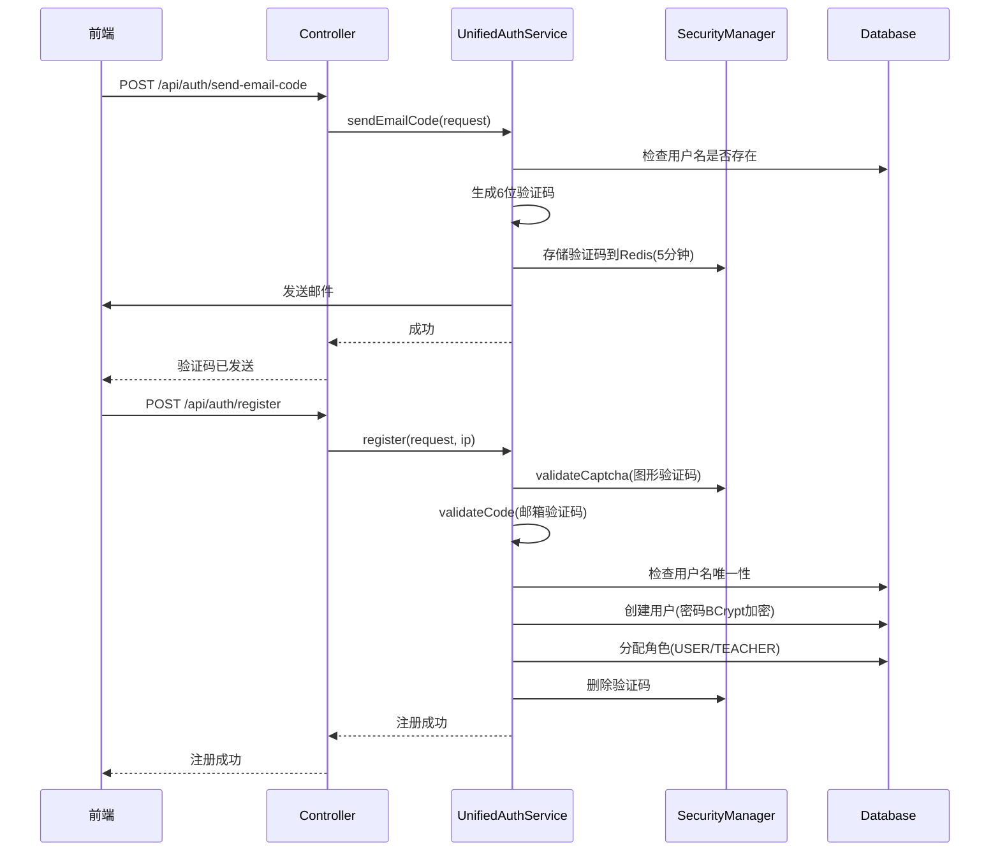
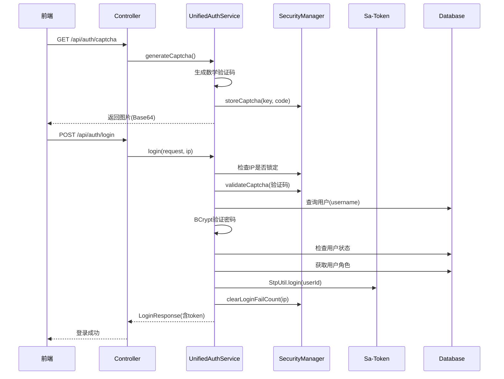
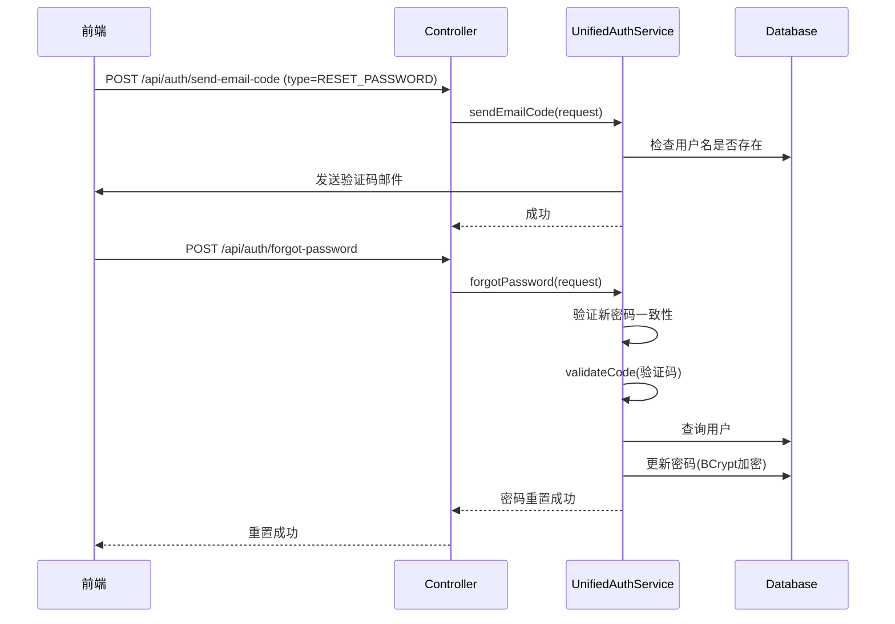

# 码趣星球 - 认证系统完整指南

> 版本：2.0  
> 更新时间：2025-01-12  
> 作者：jieni

---

## 📚 目录

- [系统概述](#系统概述)
- [快速开始](#快速开始)
- [架构设计](#架构设计)
- [核心流程](#核心流程)
- [API接口](#api接口)
- [数据模型](#数据模型)
- [安全机制](#安全机制)
- [开发指南](#开发指南)
- [故障排查](#故障排查)

---

## 系统概述

### 简介

码趣星球认证系统是一个基于 **Spring Boot 3.2.0 + Sa-Token** 的企业级认证授权解决方案，支持多角色、多场景的用户认证和权限管理。

### 核心特性

- ✅ **统一认证入口** - 一个接口支持管理员、教师、学生三种角色登录
- ✅ **安全加固** - 图形验证码、邮箱验证码、IP锁定、密码加密
- ✅ **灵活扩展** - 策略模式支持不同角色权限策略
- ✅ **完善文档** - Swagger/OpenAPI 3 自动生成 API 文档
- ✅ **现代技术栈** - Java 17 + Spring Boot 3 + Jakarta Validation

### 技术栈

| 技术 | 版本 | 用途 |
|------|------|------|
| Spring Boot | 3.2.0 | 核心框架 |
| Sa-Token | 1.38.0 | 权限认证 |
| Redis | 6.0+ | 会话存储、验证码缓存 |
| MySQL | 8.0+ | 用户数据存储 |
| Kaptcha | 2.3.2 | 图形验证码 |
| Knife4j | 4.5.0 | API 文档 |
| Lombok | - | 简化代码 |
| Hutool | 5.8.25 | 工具库 |

---

## 快速开始

### 1. 启动项目

```bash
# 1. 确保 Redis 已启动
redis-server

# 2. 确保 MySQL 已启动并导入数据库
mysql -u root -p < sql/mqxq结构.sql

# 3. 启动应用
mvn spring-boot:run
```

### 2. 访问 API 文档

```
http://localhost:9999/doc.html
```

认证信息：`user / 123456`

### 3. 测试登录流程

```bash
# 1. 获取图形验证码
GET http://localhost:9999/api/auth/captcha

# 2. 用户登录
POST http://localhost:9999/api/auth/login
{
  "username": "admin@example.com",
  "password": "123456",
  "captcha": "12",
  "captchaKey": "xxx"
}

# 3. 获取当前用户信息
GET http://localhost:9999/api/auth/userinfo
Authorization: Bearer {token}
```

---

## 架构设计

### 整体架构图

```
┌─────────────────────────────────────────────────────────┐
│                     Controller 层                        │
│              CompleteUnifiedAuthController               │
│  • 接收 HTTP 请求                                        │
│  • 参数验证（@Valid）                                    │
│  • 统一返回 Result<T>                                    │
└────────────────────┬────────────────────────────────────┘
                     │
┌────────────────────▼────────────────────────────────────┐
│                     Service 层                           │
│                 UnifiedAuthService                       │
│  • 业务逻辑编排                                          │
│  • 调用 Security 和 Enhanced 组件                       │
│  • 事务管理                                              │
└────────────────────┬────────────────────────────────────┘
                     │
      ┌──────────────┴──────────────┐
      ▼                              ▼
┌──────────────┐            ┌───────────────────┐
│ Security 层   │            │ Enhanced 层        │
│ LoginSecurity │            │ UnifiedAuth       │
│ Manager       │            │ ServiceEnhanced   │
│ • IP 锁定     │            │ • 核心业务逻辑    │
│ • 验证码验证  │            │ • 密码管理        │
│ • 失败计数    │            │ • 用户信息        │
└──────────────┘            └───────────────────┘
      │                              │
      └──────────────┬───────────────┘
                     ▼
┌─────────────────────────────────────────────────────────┐
│                      DAO 层                              │
│                    UserDao                               │
│  • 数据持久化                                            │
│  • MyBatis 映射                                          │
└─────────────────────────────────────────────────────────┘
```

### 模块职责

#### Controller 层
- **职责**：HTTP 请求处理、参数验证、响应返回
- **原则**：薄 Controller，不包含业务逻辑
- **规范**：
  - 使用 `@Valid` 验证 DTO
  - 统一返回 `Result<T>`
  - 只调用 Service 接口

#### Service 层
- **UnifiedAuthService（接口）**：定义认证服务契约
- **UnifiedAuthServiceImpl（实现）**：委托给 Enhanced 服务
- **UnifiedAuthServiceEnhanced**：核心业务逻辑实现

#### Security 层
- **LoginSecurityManager**：安全验证组件
  - IP 锁定检查
  - 验证码验证和存储
  - 登录失败计数

#### DAO 层
- **UserDao**：用户数据访问
- **UserRoleDao**：用户角色关联

---

## 核心流程

### 1. 用户注册流程



**关键步骤：**

1. **发送验证码**
   - 检查用户名是否已注册
   - 生成 6 位数字验证码
   - 存储到 Redis，5 分钟有效期
   - 发送验证码邮件

2. **用户注册**
   - 验证图形验证码
   - 验证邮箱验证码
   - 检查用户名唯一性
   - BCrypt 加密密码
   - 创建用户记录
   - 根据 userType 分配角色

### 2. 用户登录流程



**关键步骤：**

1. **安全检查**
   - 检查 IP 是否被锁定
   - 验证图形验证码

2. **用户认证**
   - 根据 username 查询用户
   - BCrypt 验证密码
   - 检查用户状态（是否禁用）

3. **权限验证**
   - 获取用户角色列表
   - 验证角色权限

4. **生成凭证**
   - Sa-Token 生成 Token
   - 清除登录失败计数
   - 返回用户信息和 Token

### 3. 忘记密码流程



---

## API接口

### 认证接口 (`/api/auth`)

#### 1. 获取图形验证码

```http
GET /api/auth/captcha
```

**响应：**
```json
{
  "code": 200,
  "msg": "操作成功",
  "data": {
    "captchaKey": "abc123",
    "captchaImage": "data:image/jpeg;base64,/9j/4AAQ...",
    "expiresIn": 300
  }
}
```

#### 2. 用户登录

```http
POST /api/auth/login
Content-Type: application/json
```

**请求体：**
```json
{
  "username": "user@example.com",
  "password": "123456",
  "captcha": "12",
  "captchaKey": "abc123"
}
```

**响应：**
```json
{
  "code": 200,
  "msg": "登录成功",
  "data": {
    "userId": 1,
    "username": "user@example.com",
    "nickname": "张三",
    "avatar": "http://...",
    "token": "eyJhbGciOi...",
    "tokenType": "Bearer",
    "expiresIn": 2592000,
    "roles": ["USER"]
  }
}
```

#### 3. 用户注册

```http
POST /api/auth/register
Content-Type: application/json
```

**请求体：**
```json
{
  "username": "new@example.com",
  "password": "123456",
  "confirmPassword": "123456",
  "name": "张三",
  "phone": "13800138000",
  "code": "123456",
  "userType": "USER",
  "captcha": "12",
  "captchaKey": "abc123"
}
```

#### 4. 发送邮箱验证码

```http
POST /api/auth/send-email-code
Content-Type: application/json
```

**请求体：**
```json
{
  "username": "user@example.com",
  "type": "REGISTER"  // REGISTER | RESET_PASSWORD | BIND_EMAIL
}
```

#### 5. 忘记密码

```http
POST /api/auth/forgot-password
Content-Type: application/json
```

**请求体：**
```json
{
  "username": "user@example.com",
  "code": "123456",
  "newPassword": "newpass123",
  "confirmPassword": "newpass123"
}
```

#### 6. 修改密码（需登录）

```http
POST /api/auth/change-password
Content-Type: application/json
Authorization: Bearer {token}
```

**请求体：**
```json
{
  "oldPassword": "123456",
  "newPassword": "654321",
  "confirmPassword": "654321"
}
```

#### 7. 获取当前用户信息

```http
GET /api/auth/userinfo
Authorization: Bearer {token}
```

#### 8. 登出

```http
POST /api/auth/logout
Authorization: Bearer {token}
```

#### 9. 刷新 Token

```http
POST /api/auth/refresh-token
Authorization: Bearer {token}
```

#### 10. 更新个人资料

```http
POST /api/auth/update-profile
Content-Type: application/json
Authorization: Bearer {token}
```

**请求体：**
```json
{
  "name": "李四",
  "phone": "13900139000",
  "avatar": "http://..."
}
```

#### 11. 更换用户名

```http
POST /api/auth/bind-email
Content-Type: application/json
Authorization: Bearer {token}
```

**请求体：**
```json
{
  "username": "new-email@example.com",
  "code": "123456"
}
```

#### 12. 检查用户名可用性

```http
GET /api/auth/check-username?username=user@example.com
```

---

## 数据模型

### DTO 规范

所有 DTO 必须遵循以下规范：

#### 命名规范

- **Request DTO**：`XxxRequest`（如 `LoginRequest`）
- **Response DTO**：`XxxResponse`（如 `LoginResponse`）
- **其他 DTO**：`XxxDTO`（如 `UserDTO`）

#### 注解规范

```java
@Data                                    // 必需：Lombok 生成 getter/setter
@Schema(description = "登录请求")         // 必需：Swagger 文档
public class LoginRequest {
    
    @NotBlank(message = "用户名不能为空")   // 验证注解
    @Email(message = "用户名格式不正确")
    @Schema(description = "用户名", 
            example = "user@example.com", 
            requiredMode = Schema.RequiredMode.REQUIRED)
    private String username;
}
```

#### 验证注解参考

| 注解 | 说明 | 示例 |
|------|------|------|
| `@NotNull` | 不能为 null | `@NotNull(message = "ID不能为空")` |
| `@NotBlank` | 不能为 null 且 trim 后长度 > 0 | `@NotBlank(message = "用户名不能为空")` |
| `@Email` | 必须是邮箱格式 | `@Email(message = "邮箱格式不正确")` |
| `@Size` | 字符串长度或集合大小 | `@Size(min = 6, max = 20)` |
| `@Min` | 最小值 | `@Min(value = 1)` |
| `@Max` | 最大值 | `@Max(value = 100)` |
| `@Pattern` | 正则表达式匹配 | `@Pattern(regexp = "^1[3-9]\\d{9}$")` |

### VO 规范

```java
@Data
@Schema(description = "用户详情")
public class UserDetailVO {
    
    @Schema(description = "用户ID")
    private Integer id;
    
    @Schema(description = "用户名")
    private String username;
    
    // 不需要 implements Serializable
    // 不需要验证注解（只用于展示）
}
```

### Entity 规范

```java
@Data
@TableName("user")
public class User implements Serializable {
    
    private Integer id;
    private String username;
    private String password;  // BCrypt 加密
    private String name;
    private String phone;
    private String avatar;
    private Integer status;   // 0-禁用 1-启用
    private Date createTime;
    private Date updateTime;
}
```

---

## 安全机制

### 1. 密码安全

**加密算法：** BCrypt

```java
// 加密
String encryptedPassword = SaUtil.toBcPassword(plainPassword);

// 验证
boolean isMatch = SaUtil.checkBcPassword(plainPassword, encryptedPassword);
```

**特点：**
- 每次加密结果不同（salt 随机）
- 10 轮哈希
- 抗暴力破解

### 2. IP 锁定策略

**配置：**
```java
LoginConstants.MAX_LOGIN_FAIL_TIMES = 5;     // 最大失败次数
LoginConstants.LOGIN_LOCK_TIME = 30;         // 锁定时长（分钟）
```

**流程：**
1. 登录失败时递增计数
2. 达到 5 次后锁定 IP 30 分钟
3. 登录成功清除计数

**存储：**
```
Redis Key: login:fail:limit:{ip}
TTL: 1800 秒（30 分钟）
```

### 3. 验证码机制

#### 图形验证码

- **类型**：数学运算（如 `1+2=?`）
- **有效期**：5 分钟
- **存储**：`login:captcha:{captchaKey}`
- **验证后**：立即删除

#### 邮箱验证码

- **格式**：6 位数字
- **有效期**：5 分钟
- **存储**：`code:{type}:{username}`
- **频率限制**：60 秒内只能发送一次

### 4. Token 管理

> Sa-Token 配置详见 [公共参考-Sa-Token配置](公共数据模型与基础配置.md#二认证与权限体系sa-token)

**Token 刷新：**
```java
// 自动续期，每次请求都会延长有效期
StpUtil.checkLogin();
```

### 5. 权限验证

**基于角色的访问控制（RBAC）：**

```java
@SaCheckRole("ADMIN")
public Result<?> adminOnly() {
    // 只有管理员可访问
}

@SaCheckRole(value = {"ADMIN", "TEACHER"}, mode = SaMode.OR)
public Result<?> adminOrTeacher() {
    // 管理员或教师可访问
}
```

**角色类型：**
- `ADMIN`：管理员
- `TEACHER`：教师
- `USER`：学生

---

## 开发指南

### 添加新的认证方式

#### 1. 创建 DTO

```java
@Data
@Schema(description = "手机号登录请求")
public class PhoneLoginRequest {
    
    @NotBlank(message = "手机号不能为空")
    @Pattern(regexp = "^1[3-9]\\d{9}$")
    @Schema(description = "手机号")
    private String phone;
    
    @NotBlank(message = "验证码不能为空")
    @Schema(description = "短信验证码")
    private String code;
}
```

#### 2. 添加 Service 方法

```java
public interface UnifiedAuthService {
    LoginResponse phoneLogin(PhoneLoginRequest request, String ipAddress);
}
```

#### 3. 实现业务逻辑

```java
@Override
public LoginResponse phoneLogin(PhoneLoginRequest request, String ipAddress) {
    // 1. 验证短信验证码
    // 2. 查询用户
    // 3. 执行登录
    // 4. 返回 Token
}
```

#### 4. 添加 Controller 接口

```java
@PostMapping("/phone-login")
@Operation(summary = "手机号登录")
public Result<LoginResponse> phoneLogin(
        @Valid @RequestBody PhoneLoginRequest request,
        HttpServletRequest httpRequest) {
    String ip = IpUtils.getIpAddr();
    LoginResponse response = unifiedAuthService.phoneLogin(request, ip);
    return Result.success(response);
}
```

### 自定义验证规则

```java
// 创建自定义验证注解
@Target({ElementType.FIELD})
@Retention(RetentionPolicy.RUNTIME)
@Constraint(validatedBy = StrongPasswordValidator.class)
public @interface StrongPassword {
    String message() default "密码强度不足";
    Class<?>[] groups() default {};
    Class<? extends Payload>[] payload() default {};
}

// 实现验证器
public class StrongPasswordValidator 
        implements ConstraintValidator<StrongPassword, String> {
    
    @Override
    public boolean isValid(String value, ConstraintValidatorContext context) {
        // 至少包含数字、字母、特殊字符
        return value != null && 
               value.matches("^(?=.*[0-9])(?=.*[a-zA-Z])(?=.*[@#$%]).{8,}$");
    }
}
```

---

## 故障排查

### 常见问题

#### 1. Lombok getter/setter 方法未生成

**现象：** 编译错误 `找不到符号: 方法 getXxx()`

**原因：** Lombok 注解处理器未执行

**解决方案：**
```bash
# 方案 1：清理重编译
mvn clean compile

# 方案 2：IDE 清理缓存
# IntelliJ IDEA: File → Invalidate Caches → Restart

# 方案 3：检查 Lombok 插件是否启用
```

#### 2. 登录失败："验证码已失效"

**原因：** Redis 未启动或验证码已过期

**解决方案：**
```bash
# 检查 Redis 是否运行
redis-cli ping
# 期望输出：PONG

# 如果未运行，启动 Redis
redis-server
```

#### 3. 登录失败："IP已被锁定"

**原因：** 登录失败次数过多

**解决方案：**
```bash
# 手动解锁 IP
redis-cli
> DEL login:fail:limit:192.168.1.100
```

#### 4. Token 验证失败

**原因：** Token 过期或无效

**解决方案：**
```bash
# 检查 Token 有效期
GET /api/auth/check-login-status

# 刷新 Token
POST /api/auth/refresh-token
```

### 调试技巧

#### 开启 DEBUG 日志

```yaml
# application.yml
logging:
  level:
    com.jieni.mqxq.service.impl.auth: DEBUG
    com.jieni.mqxq.common.security: DEBUG
```

#### 查看 Redis 数据

```bash
redis-cli
> KEYS login:*
> KEYS code:*
> GET login:captcha:abc123
```

#### 测试 BCrypt 密码

```java
String password = "123456";
String encrypted = SaUtil.toBcPassword(password);
boolean isMatch = SaUtil.checkBcPassword(password, encrypted);
```

---

## 附录

### 配置文件示例

> Sa-Token 完整配置详见 [公共参考-Sa-Token配置](公共数据模型与基础配置.md#二认证与权限体系sa-token)

```yaml
# application.yml
spring:
  datasource:
    url: jdbc:mysql://localhost:3306/mqxq
    username: root
    password: password
    
  redis:
    host: localhost
    port: 6379
    
springdoc:
  api-docs:
    enabled: true
  swagger-ui:
    enabled: true
```

### 数据库表结构

> 数据库表结构详见 [公共参考-数据库表结构汇总](数据库表结构汇总.md)

---

## 更新日志

### 2.0 (2025-01-12)
- ✅ 重构认证系统，统一 API 接口
- ✅ 删除过时代码（LoginService、LoginDao 等）
- ✅ 统一 DTO 命名规范
- ✅ 完善安全机制
- ✅ 更新文档

---

## 联系我们

如有问题，请联系：
- 作者：jieni
- 项目：码趣星球
- 文档版本：2.0

---

**© 2025 码趣星球. All rights reserved.**

